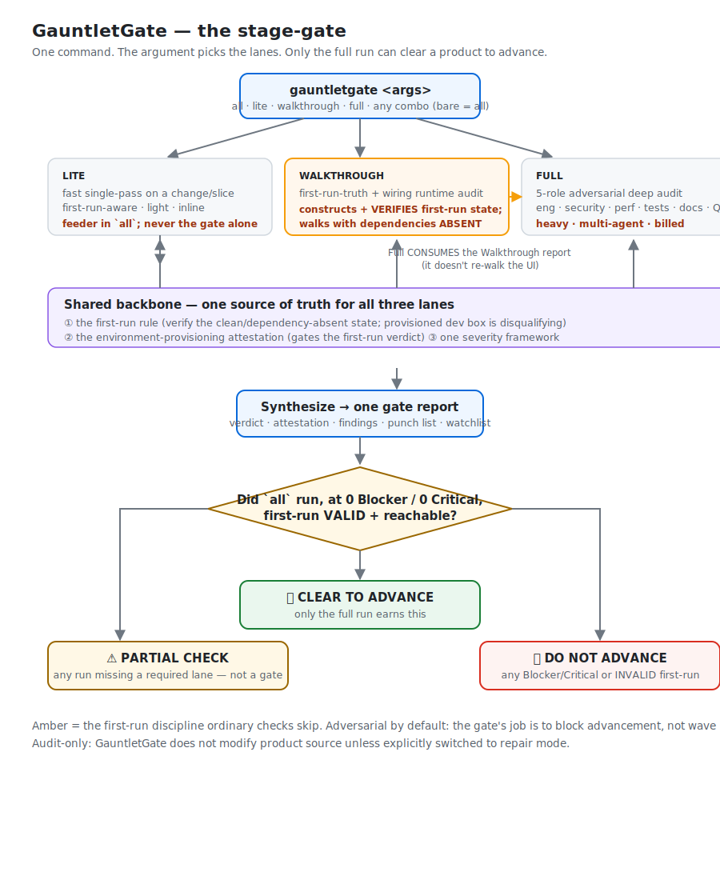

# GauntletGate — Manual

Version 0.2.0

GauntletGate is an adversarial **stage-gate**: a product runs the gauntlet to earn
the right to advance to the next stage, sprint, or release. This manual covers what
it is, how to run it, the three lanes, the architecture, the verdict, the first-run
discipline that is its spine, and its honest limits.

---

## 1. What it is (and isn't)

A **skill** — Markdown instructions an AI coding agent loads and follows. Not a
binary, not CI, not a service. It reads your repo as the source of truth and drives
your running app with Playwright. One command, three lanes; the argument selects
which run.

**Use it** at the end of a stage/sprint or before release, to get an honest
go/no-go: *is this ready to advance — including for a brand-new user — or does it
only work on the machine it was built on?*

It is **adversarial by default**: its job is to block advancement until the product
is genuinely ready, not to find reasons to wave it through.

> **Read this up front (full detail in §7):** GauntletGate is *guidance an agent
> follows*, not a mechanical lock. It makes the first-run pass mandatory, gates the
> verdict on a verified attestation that must link to on-disk artifacts, and forbids a
> partial run from claiming CLEAR TO ADVANCE — but it ultimately relies on the agent
> executing it faithfully. A gap is never a pass. (Mechanical enforcement is on the
> roadmap.)

---

## 2. Install & run

```bash
python install.py                      # -> ~/.claude/skills/gauntletgate/ (every project)
python install.py --project PATH       # -> PATH/.claude/skills/gauntletgate/ (one repo)
```

Then, in a fresh session:

```
/gauntletgate all          # the full stage-gate (also the bare-command default)
/gauntletgate lite
/gauntletgate walkthrough
/gauntletgate full
/gauntletgate lite walkthrough     # any combination, run in canonical order
```

---

## 3. The three lanes

| Lane | What it does | Weight |
|------|--------------|--------|
| **Lite** | Fast single-pass on a change/slice — same severity bar, compressed. First-run-aware. | light, inline |
| **Walkthrough** | First-run-truth + interface-wiring runtime audit. Constructs and **verifies** the first-run state; walks the product with dependencies **absent**; produces the environment attestation and the "can a new user reach the core feature?" verdict. | light–medium, inline |
| **Full** | Five-role adversarial deep audit (Principal Engineer, UI/UX, Technical Writer, Test Engineer, QA Engineer). **Consumes the Walkthrough report** instead of re-walking the UI. | **heavy — 5-agent fan-out, billed, needs multi-agent opt-in** |

The lanes are defined in `skill/gauntletgate/lanes/{lite,walkthrough,full}.md`.

---

## 4. Architecture



The command dispatches by argument to the selected lanes, run in canonical order
(**Lite → Walkthrough → Full**). All three obey a single **shared backbone**
(`skill/gauntletgate/references/shared-backbone.md`): the first-run rule, the
environment-provisioning attestation, and one severity framework — so the lanes can
never drift apart. **Full consumes the Walkthrough report**, so the two compound
instead of overlapping. The dispatcher then synthesizes one gate report and emits the
verdict.

---

## 5. The verdict

(Full rules: `skill/gauntletgate/references/gate-verdict.md`.)

- **CLEAR TO ADVANCE** — only when the **Walkthrough and Full lanes both ran** (i.e.
  `all`, or explicitly `walkthrough full`), at **0 Blocker / 0 Critical**, with
  **first-run coverage VALID and the core feature reachable by a new user.** Majors/Minors/Nits ride along on the punch list /
  watchlist; they don't block advancement (unless your project sets a stricter bar,
  e.g. 0/0/0/0/0, which the gate will honor if you state it).
- **PARTIAL CHECK** — any run missing a required lane (`lite`, `walkthrough` alone,
  `full` alone, `lite walkthrough`, …). It reports findings but is explicitly **not**
  an advancement gate. A cheap run can never masquerade as the full gate.
- **DO NOT ADVANCE** — any Blocker/Critical, or INVALID first-run coverage on a
  product with a first-run surface, plus the blocking punch list to clear before a
  re-run.

---

## 6. The first-run discipline (the spine)

GauntletGate exists because of a real miss: a product reported **"near-clean (1
Minor)"** while a brand-new user with no model server hit an immediate dead-end — the
check ran on a provisioned dev box whose "clean profile" isolation had silently
failed. So every lane that touches a first-run / onboarding / dependency / empty-data
surface must:

1. **Construct and VERIFY** the true first-run state (fresh isolated profile,
   dependencies **absent**, empty data) — and *prove* the app used the clean state.
2. **Probe** dependencies rather than assume them.
3. **Walk the product with each dependency ABSENT** — the new-user reality.
4. Treat an **already-provisioned environment as disqualifying** — if a clean state
   can't be verified, first-run coverage is **INVALID** and the gate can't report
   clean.
5. File a **first-run dead-end on the core feature as a Blocker.**

This standard lives once in the shared backbone; all three lanes obey it.

---

## 7. Honest limits

- It is **guidance an agent follows**, not a mechanical lock. It makes the first-run
  pass mandatory, gates the verdict on a verified attestation, and forbids a partial
  run from claiming CLEAR TO ADVANCE — the strongest a skill can be — but it relies on
  the agent executing it faithfully.
- It **audits; it doesn't fix.** Audit-only by default; switch to repair mode
  explicitly for changes.
- It's only as good as the states it can construct. A dependency it can't remove, or
  an app it can't run, is reported as a coverage gap — not silently skipped, and not a
  pass.
- `full`/`all` fan out 5 subagents (billed, multi-agent opt-in). `lite` and
  `walkthrough` are light and inline.
- Written for and verified against Claude Code and Codex; the method is agent-agnostic
  but assumes an agent that can run Playwright and read your repo.

---

## 8. FAQ

**Can a `lite` run greenlight a stage?** No. Only `all` can be CLEAR TO ADVANCE;
everything else is a PARTIAL CHECK by design.

**No external dependency in my product?** The dependency-absent axis just doesn't
apply; first-run, empty-data, and onboarding states still do.

**My product has no UI at all (a library / API / CLI)?** Then "can a new user reach
the core feature?" is **N/A** — the attestation records first-run coverage as N/A
with the reason, and the verdict's first-run line reads N/A instead of ✅/❌. The
adjacent dimensions still apply where they fit: first use from a genuinely clean
install (fresh venv / node_modules / a machine without the global tool), behavior
when a **dependency is absent**, and empty/initial-state paths. N/A is a reasoned
call, never a way to skip a first-run surface that does exist.

**Will it change my code?** No, not in audit mode.

**Why fold three skills into one?** So an end-of-stage gate is a single, consistent,
adversarial decision — with one first-run standard and one severity scale — instead of
three checks you have to remember to run and reconcile by hand.
